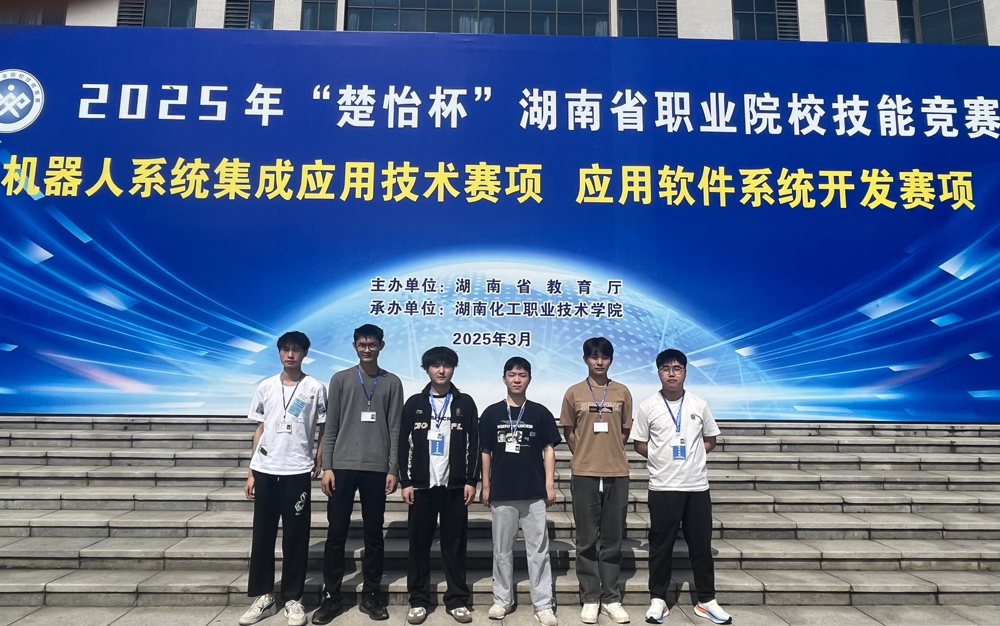
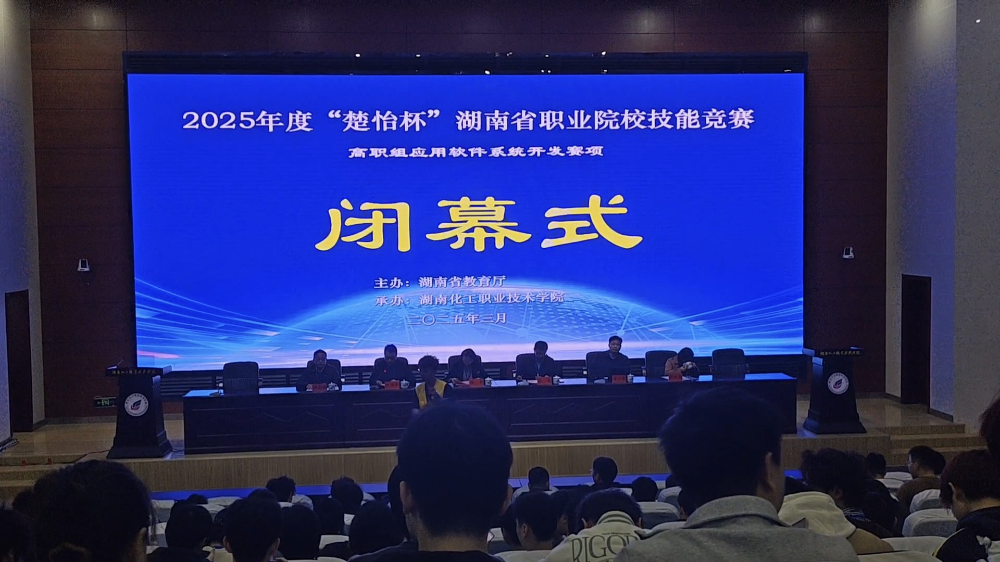
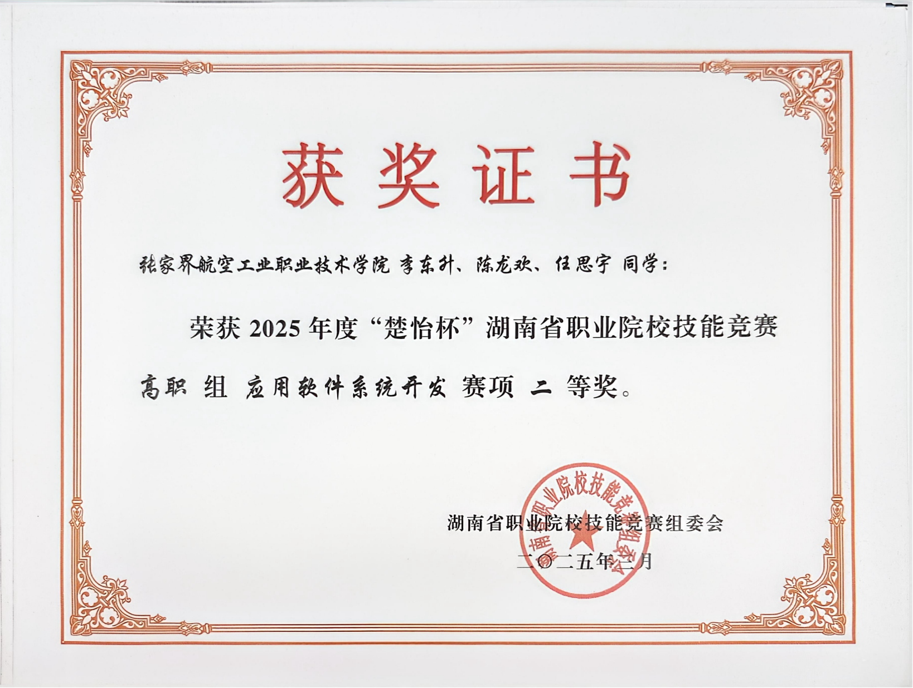
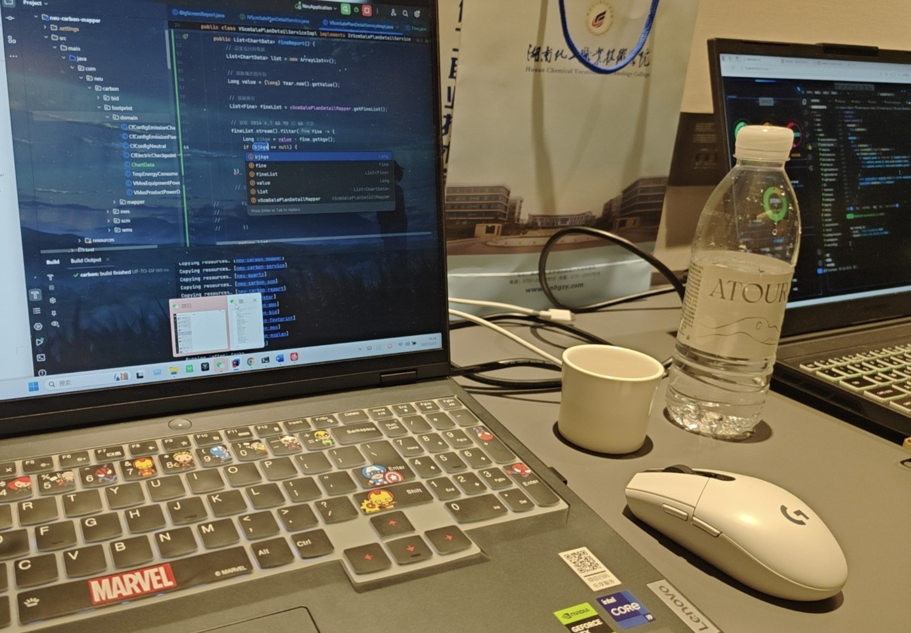
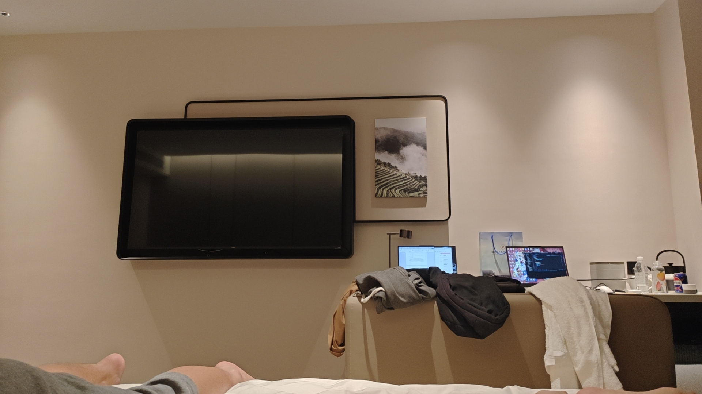
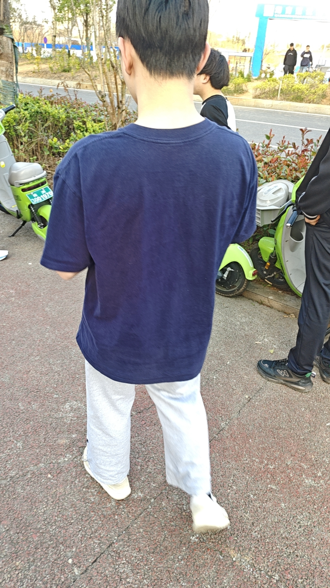
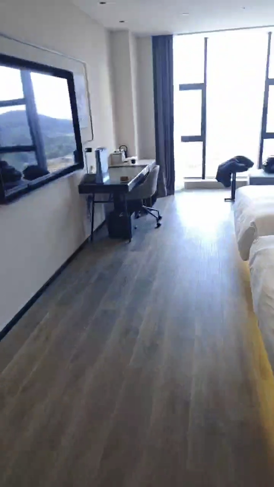

## 参赛相关图片

## 2023-09

* 我在工厂做技术员做了一年四个月，但是觉得我这辈子不应该是这样的，于是我报名参加往届生单招，可能是上天眷顾我吧，我成功录取进入了张航。

## 2023-10

* 我已经进入校园一个月了，说实话我是一个特别难适应新环境的人，刚到宿舍因为害怕陌生环境去酒店住了两个晚上，不过后来慢慢就适应了环境开始接受了。

## 2023-11

* 学习专业课已经两个月了，听不懂特别内耗，回宿舍就是打游戏，直到这个月我找到学习的方法了，没日没夜的卷作业，在哔哩哔哩上黑马的课程疯狂补之前摆烂漏掉的知识，
* 我成功了，项老师发现了我，项老师是带我们学校的楚怡杯应用软件系统开发赛道的，后面项老师经常跟我说这个比赛的重要性，我身边的同学也在其他专业拿到了楚怡杯奖项，于是我下定决心，我必须拿下一个奖项证明自己。

## 2023-12

* 已经到大一上学期末了，学的还不错，项老师让我们寒假做出来前后端的小demo，我压力瞬间暴增，不知道从何入手，于是就先去哔哩哔哩黑马程序员学习javascript和ajax。

## 2024-01

* 我已经学完了javascript和ajax但是我不晓得后端服务接口怎么写，于是就先用html，css，javascript和假数据写了个管理系统。

## 2024-02

* 快开学了，原生管理系统搞完了就是没有后端。

## 2024-03

* 来到学校了，我还是不晓得接口怎么搞出来，于是就通过项老师拉的竞赛群去问学长，然后认识了李昊华和李威，那天我背着书包来到他们宿舍，我非常认真的听他们教我，我使用了他们给我二开的接口，我做出来了可以操作数据库，我把这个项目交给了项老师，
  项老师给我一个赞赏的表情包，但是我说接口不是我写的，所以说项目就完成了一半，后面就去学习接口...

## 2024-06

*
我已经学完了vue2，vue3，springboot，axios，maven，mybatis，然后项老师让我学期教个vue和springboot的后台管理，我一个星期做出来，我背着电脑带着书包满怀期待的去找项老师，果然项老师夸我了项目很完美，增删改查，令牌，路由守卫，我很开心。
* 李昊华他们已经要离校实训了，他叫我去他宿舍检东西，他的东西好多跟工厂一样扎带都有，然后我认识了3班史晨翔聊了一会还挺合的来的。

## 2024-07

* 大一下暑假了，项老师已经不带竞赛了，我很伤心，但是学习不能停不然怎么对得起老师的培养，我暑假学完了ssm和苍穹外卖。

## 2024-09

* 不知不觉已经来到大二上了，终于没有文化课了，开心。

## 2024-10

* 开始选拔参加楚怡杯的选手了，我也入选了，然后就停课了。

## 2024-11

* 培训时间...

## 2025-03-23

* 比赛结束荣获省二...

