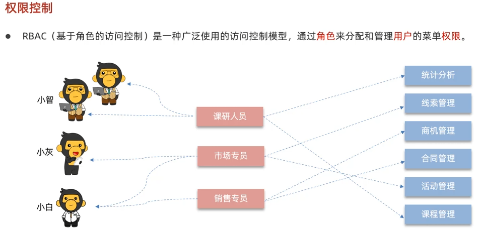
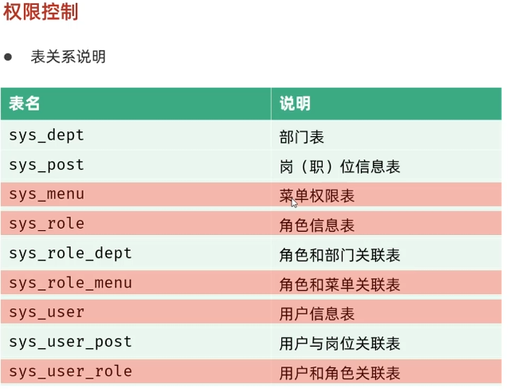

# MySQL 简介

MySQL 是一个开源的关系型数据库管理系统（RDBMS），广泛应用于各种规模的应用程序中。它以其高性能、可靠性和易用性而著称。

## 主要特性

- **高性能**：MySQL 在处理大量数据时表现出色。
- **可靠性**：支持事务处理，确保数据的一致性和完整性。
- **易用性**：提供了丰富的工具和接口，方便开发和管理。
- **跨平台**：支持多种操作系统，如 Windows、Linux、macOS 等。
- **社区支持**：拥有庞大的用户社区和丰富的资源。

## 安装与配置

### 安装步骤

1. 下载 MySQL 安装包。
2. 根据操作系统选择合适的安装方式。
3. 配置 MySQL 服务，设置 root 用户密码。

### 配置文件

MySQL 的主要配置文件是 `my.cnf` 或 `my.ini`，位于 MySQL 安装目录下。可以通过修改此文件来调整 MySQL 的性能参数和行为。

## sql

### DML

```text
插入数据-INSERT INTO 表名 VALUES (值1,值2,值3,..);
```

```text
删除数据-DELETE FROM 表名 WHERE 条件:
```

```text
更新数据-UPDATE 表名 SET 字段名 =新值 WHERE 条件:
```

### DQL

```text
简单查询-SELECT 字段名1,字段名2 FROM 表名:
```

```text
条件查询-SELECT*FROM 表名 WHERE 条件;
```

```text
模糊査询-SELECT*FROM 表名 WHERE 字段名 LIKE'%';
```

```text
查询排序-SELECT* FROM 表名 WHERE 条件 ORDER BY 字段名 ASCIDESC
```

```text
查询分组-SELECT*FROM 表名 WHERE 条件 GROUP BY 字段;
```

```text
聚合函数-SELECT COUNT(*), SUM(*), MAX(*), MIN(*),AVG(*) FROM 表名 WHERE 条件:
```

```text
limit语句-SELECT* FROM 表名 WHERE 条件 LlMIT offset, length;
```

### DDL

```text
创建数据库-CREATE DATABASE 数据库名:
```

```text
修改数据库-ALTER DATABASE 数据库名 DEFAULT CHARACTER SET 字符集
```

```text
查看所有数据库-SHOW DATABASES:
```

```text
删除数据库-DROP DATABASE 数据库名;
```

```text
查看某个数据库中的所有表-SHOW TABLES;
```

```text
创建表-CREATE TABLE 表名(字段名1 字段类型1,字段名2 字段类型2);
```

```text
主键自增-字段名 字段类型 PRIMARY KEY AUTOINCREMENT
```

```text
删除表-DROP TABLE 表名;
```

```text
修改表结构添加一列-ALTER TABLE 表名 ADD 字段名 字段类型
```

```text
修改表结构修改列类型-ALTER TABLE 表名 MODIFY 字段名 新类型:
```

```text
修改表结构修改列名-ALTER TABLE 表名 CHANGE 老字段名 新字段名 类型;
```

```text
修改表结构删除列-ALTER TABLE 表名 DROP 字段名:
```

```text
修改表结构修改表名-RENAME TABLE 表名 TO 新表名;
```

```text
修改表的字符集-ALTER TABLE 表名 DEFAULT CHARACTER SET 新字符集;
```

```text
查看表结构-DESC 表名;
```

```text
删除主键-ALTER TABLE 表名 DROP PRIMARY KEY;
```

```text
蠕虫复制-INSERT INTO 表名1 SELECT*FROM 表名2;
```

## 常用命令

- **启动 MySQL 服务**：

```shell
sudo service mysql start
```

- **停止 MySQL 服务**：

```shell
sudo service mysql stop
```

- **进入 MySQL 命令行**：

```shell
mysql -u root -p
```

## 通过多对多的关系设计权限管理表(若依权限管理案例)





```sql
-- 查询 用户和 对应角色和 分配的菜单
-- 选择用户表内连接用户和角色的中间表 条件 （用户表的user_id = 用户和角色的中间表的user_id）
-- 再内连接角色和菜单的中间表 条件 （用户和角色连表的user_id = 角色和菜单中间表的角色id）
-- 再内连接菜单表 条件（菜单表的menu_id = 角色和菜单连表的menu_id）
SELECT user.user_name,
       u_r.role_id,
       s_m.menu_name
FROM sys_user user
         JOIN sys_user_role u_r ON user.user_id = u_r.user_id
         JOIN sys_role_menu r_m ON u_r.role_id = r_m.role_id
         JOIN sys_menu s_m ON s_m.menu_id = r_m.menu_id
```

## MySql视图

### 理论介绍

**视图（View）** 是数据库中的一个虚拟表，其内容由查询定义。同真实的表一样，视图包含多行数据，每行包含多个列。但是视图并不在数据库中以存储的数据值集形式存在，行和列的数据来自由定义视图的查询所引用的表，并且在引用视图时动态生成。

视图的主要用途包括：

- **简化复杂的查询**：视图可以隐藏复杂的SQL查询逻辑，使得用户可以通过简单的查询访问复杂的数据。
- **增强安全性**：通过视图，可以限制用户只能访问特定的数据，从而提高数据库的安全性。
- **数据独立性**：视图可以提供一个稳定的接口，即使底层表结构发生变化，只要视图定义不变，应用程序就不需要修改。

### 基本API操作

#### 创建视图

```sql
CREATE VIEW view_name AS
SELECT column1, column2,
...FROM table_name WHERE condition;
```

#### 查询视图

```sql
SELECT *
FROM view_name;
```

#### 更新视图

```sql
CREATE OR REPLACE VIEW view_name AS
SELECT column1, column2,
...FROM table_name WHERE condition;
```

#### 删除视图

```sql
DROP VIEW view_name;
```

### 解释

1. **创建视图**：使用`CREATE VIEW`语句创建一个新的视图。
2. **查询视图**：使用`SELECT`语句从视图中检索数据。
3. **更新视图**：使用`CREATE OR REPLACE VIEW`语句更新现有的视图。
4. **删除视图**：使用`DROP VIEW`语句删除不再需要的视图。

### 使用视图完成多表查询案例

假设有两个表 `employees` 和 `departments`，我们希望创建一个视图来查询每个员工及其所属部门的信息。

#### 表结构

**employees**

| employee_id | first_name | last_name | department_id |
|-------------|------------|-----------|---------------|
| 1           | John       | Doe       | 1             |
| 2           | Jane       | Smith     | 2             |

**departments**

| department_id | department_name |
|---------------|-----------------|
| 1             | HR              |
| 2             | Engineering     |

#### 创建视图

```sql
CREATE VIEW employee_department_view AS
SELECT employees.employee_id, employees.first_name, employees.last_name, departments.department_name
FROM employees
         JOIN departments ON employees.department_id = departments.department_id;
```

#### 查询视图

```sql
SELECT *
FROM employee_department_view;
```

#### 查询结果

| employee_id | first_name | last_name | department_name |
|-------------|------------|-----------|-----------------|
| 1           | John       | Doe       | HR              |
| 2           | Jane       | Smith     | Engineering     |

### 解释

1. **理论介绍**：提供了关于视图的基本概念、用途和优点。
2. **基本API操作**：详细列出了创建、查询、更新和删除视图的SQL语句。
3. **使用视图完成多表查询案例**：展示了如何使用视图来简化多表查询的过程。

### 总结

* MySQL视图是一种强大的工具，能够简化数据访问，提高代码复用，并提供额外的安全层。理解视图的创建、查询、修改和删除，以及如何在视图上执行数据操作，对于数据库管理至关重要。
* 在大型项目或多系统环境中，视图的运用尤为重要，能有效提升系统的灵活性和安全性。

## 数据统计案例(查询从当前周一开始每天的数据)

```sql
SELECT-- : 选择要查询的列或表达式
      CASE DAYOFWEEK(login_time) -- 根据登录时间的星期几进行条件判断，DAYOFWEEK函数返回1（周日）到7（周六）
          WHEN 2 THEN 'Monday' -- 当DAYOFWEEK结果为2时，表示周一
          WHEN 3 THEN 'Tuesday' -- 当DAYOFWEEK结果为3时，表示周二
          WHEN 4 THEN 'Wednesday' -- 当DAYOFWEEK结果为4时，表示周三
          WHEN 5 THEN 'Thursday' -- 当DAYOFWEEK结果为5时，表示周四
          WHEN 6 THEN 'Friday' -- 当DAYOFWEEK结果为6时，表示周五
          WHEN 7 THEN 'Saturday' -- 当DAYOFWEEK结果为7时，表示周六
          WHEN 1 THEN 'Sunday' -- 当DAYOFWEEK结果为1时，表示周日
          END  AS day_of_week, -- 结束CASE语句，并将结果命名为day_of_week
      COUNT(*) AS login_count  --  统计每个分组中的记录数，并将结果命名为login_count
FROM sys_logininfor -- 从sys_logininfor表中查询数据
WHERE YEARWEEK(login_time, 1) = YEARWEEK(CURDATE(), 1) -- 过滤出当前周的数据，YEARWEEK函数返回年份和周数
GROUP BY day_of_week -- 按day_of_week分组
ORDER BY FIELD(day_of_week, 'Monday', 'Tuesday', 'Wednesday', 'Thursday', 'Friday', 'Saturday', 'Sunday') -- 按指定顺序对结果排序
```

## 总结

MySQL 是一个强大且易于使用的数据库管理系统，适用于各种规模的应用程序。通过合理配置和优化，可以充分发挥其性能优势。
