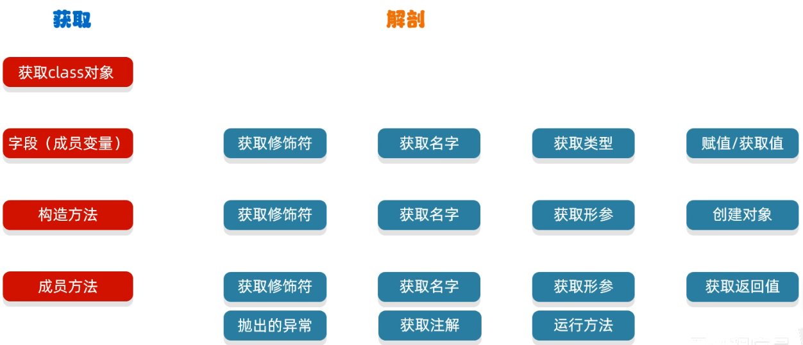

## JavaSE 简介

Java Standard Edition（JavaSE）是 Java 平台的标准版，提供了丰富的 API 和工具，用于开发桌面应用程序和小型应用程序。JavaSE 包含了
Java 编程语言的核心类库，涵盖了从基本的数据类型、集合框架、输入输出流到多线程、网络编程等多个方面。

## 核心特性

1. **跨平台性**：一次编写，到处运行（Write Once, Run Anywhere）。
2. **面向对象**：支持面向对象编程（OOP）的基本特性，如封装、继承和多态。
3. **安全性**：内置的安全机制，如沙箱模型和字节码验证。
4. **高性能**：JVM 优化和 JIT 编译器提高了运行效率。
5. **丰富的 API**：提供了大量的标准库，支持各种应用场景。

## 基本语法

### 变量声明

```java
int age = 25;
double salary = 5000.50;
String name = "John Doe";
boolean isStudent = true;
```

### 控制结构

#### 条件语句

```java
if(age >=18){
        System.out.

println("成年人"); 
}else{
        System.out.

println("未成年人"); 
}
```

#### 循环语句

```java
for(int i = 0;
i< 10;i++){
        System.out.

println(i); 
}
        while(age< 30){
        System.out.

println("年龄小于30");

age++;
        }
```

### 数组

```java
int[] numbers = {1, 2, 3, 4, 5}; 
for(
int number :numbers){
        System.out.

println(number); 
}
```

## 面向对象编程

### 类和对象

```java
class Person {
    String name;
    int age;

    public Person(String name, int age) {
        this.name = name;
        this.age = age;
    }

    public void introduce() {
        System.out.println("我叫 " + name + "，今年 " + age + " 岁。");
    }
}

public class Main {
    public static void main(String[] args) {
        Person person = new Person("张三", 25);
        person.introduce();
    }
}
```

### 继承

```java
class Student extends Person {
    String school;

    public Student(String name, int age, String school) {
        super(name, age);
        this.school = school;
    }

    public void study() {
        System.out.println(name + " 在 " + school + " 学习。");
    }
}

public class Main {
    public static void main(String[] args) {
        Student student = new Student("李四", 20, "北京大学");
        student.introduce();
        student.study();
    }
}
```

### 接口

```java
interface Animal {
    void eat();

    void sleep();
}

class Dog implements Animal {
    @Override
    public void eat() {
        System.out.println("狗在吃东西。");
    }

    @Override
    public void sleep() {
        System.out.println("狗在睡觉。");
    }
}

public class Main {
    public static void main(String[] args) {
        Dog dog = new Dog();
        dog.eat();
        dog.sleep();
    }
}
```

## 集合框架

### List

```java
import java.util.ArrayList;
import java.util.List;

public class Main {
    public static void main(String[] args) {
        List<String> names = new ArrayList<>();
        names.add("张三");
        names.add("李四");
        names.add("王五");
        for (String name : names) {
            System.out.println(name);
        }
    }
}
```

### Map

```java
import java.util.HashMap;
import java.util.Map;

public class Main {
    public static void main(String[] args) {
        Map<String, Integer> ages = new HashMap<>();
        ages.put("张三", 25);
        ages.put("李四", 30);
        for (Map.Entry<String, Integer> entry : ages.entrySet()) {
            System.out.println(entry.getKey() + ": " + entry.getValue());
        }
    }
}
```

## 泛型中的 super 和 extends 关键字用于定义类型通配符，它们分别表示不同类型的安全性约束。下面是它们的区别：

### **extends 关键字:**

    * 用于上界通配符，表示类型的上限。
    * 语法格式为 ? extends T，其中 T 是一个具体的类型。
    * 表示该类型可以是 T 或者 T 的子类型。
    * 主要用于读取数据，因为编译器只知道该类型是 T 或其子类型，但不确定具体类型，所以不能向该类型中写入数据。

### **super 关键字:**

    * 用于下界通配符，表示类型的下限。
    * 语法格式为 ? super T，其中 T 是一个具体的类型。
    * 表示该类型可以是 T 或者 T 的父类型。
    * 主要用于写入数据，因为编译器知道该类型至少是 T 或其父类型，所以可以安全地向该类型中写入 T 类型的数据。

### **示例:(extends 和 super示例)**

```java
public void copy(List<? extends Number> source, List<? super Number> destination) {
    for (Number number : source) {
        destination.add(number);
    }
}
```

* List<? extends Number> 表示源列表可以是 Number 或其子类型（如 Integer, Double 等）。
* List<? super Number> 表示目标列表可以是 Number 或其父类型（如 Object）。

### 总结

* ? extends T 用于读取数据，表示类型可以是 T 或其子类型。
* ? super T 用于写入数据，表示类型可以是 T 或其父类型。

## 枚举

* 在Java中，枚举（enum）是一种特殊的类，用于定义一组固定的常量。

* 枚举方法(枚举可以有方法，包括构造方法、实例方法和静态方法。)

```java
public enum Planet {
    /**
     * 创建枚举类对象时，不再和自定义枚举一样使用"public + static + final"关键字的组合形式,
     * 而是直按“常量名(形参列表)"搞定。(实际调用的仍然是构造器)。声明枚举对象时，必须明确调用的是哪个构造器
     * 如果使用enum来实现枚举，语法规定常量必须写在类的最前面，否则报错。
     * 如果有多个常量对象，使用逗号，间隔即可。最后一个常量后加分号。
     *
     * 例如下面一个对象                                                                                                                                                                            ：
     * MERCURY(3.303e+23, 2.4397e6), == public static final Planet PLANET = new Planet(3.303e+23, 2.4397e6);
     */
    MERCURY(3.303e+23, 2.4397e6),
    VENUS(4.869e+24, 6.0518e6),
    EARTH(5.976e+24, 6.37814e6),
    MARS(6.421e+23, 3.3972e6);

    private final double mass;
    private final double radius;

    //底层自动加上private
    Planet(double mass, double radius) {
        this.mass = mass;
        this.radius = radius;
    }

    //只提供get方法
    public double getMass() {
        return mass;
    }

    public double getRadius() {
        return radius;
    }
}

```

* 枚举的常用方法
    * **values()：** 返回枚举类型的值数组。
    * **valueOf(String name)：** 根据名称返回枚举常量。
    * **ordinal()：** 返回枚举常量的位置索引。

```java
public class TestPlanet {
    public static void main(String[] args) {
        for (Planet p : Planet.values()) {
            System.out.println(p.name() + ": 质量 = " + p.getMass() + ", 半径 = " + p.getRadius());
        }

        Planet earth = Planet.valueOf("EARTH");
        System.out.println("地球的质量: " + earth.getMass());
    }
}

```

* 使用枚举的好处
    * 类型安全：枚举提供了严格的类型检查。
    * 代码可读性：枚举使代码更易读和维护。
    * 固定集合：枚举确保了常量的固定集合，防止非法值的传入。

## synchronized

* synchronized 关键字在 Java 中用于实现线程同步，确保多个线程在访问共享资源时不会发生冲突。它的主要作用包括：
    * 互斥访问：确保同一时间只有一个线程可以执行被 synchronized 修饰的方法或代码块，防止多个线程同时修改共享资源。
    * 内存可见性：保证一个线程对共享变量的修改对其他线程是立即可见的，避免因缓存导致的数据不一致问题。
* 具体使用方式有两种：
    1. 同步方法(这种方式会锁住当前对象实例。)

    ```java
    //当 synchronized 修饰一个实例方法时，锁对象是当前实例对象 this。
    public synchronized void method() {
        // 方法体
    }
    ```

    2. 同步代码块(这种方式可以更细粒度地控制锁的范围，通常使用一个类的静态对象或 this 作为锁对象。)

    ```java
    //当 synchronized 修饰一个代码块时，需要指定一个对象作为锁。
    synchronized (FileController.class) {
        flag = System.currentTimeMillis() + "";
        // 使当前线程暂停1毫秒，确保时间戳不同
        ThreadUtil.sleep(1L);
    }
    ```
* 总结synchronized
    * 使用 synchronized (FileController.class) 确保同一时间只有一个线程可以执行这段代码，从而避免时间戳冲突和线程安全问题。

## 异常处理

* 在 Java 中，异常主要分为两大类：检查型异常（Checked Exceptions）和非检查型异常（Unchecked
  Exceptions）。此外，还有一些特殊的异常类型，如错误（Errors）。以下是详细的分类和解释：

    1. 检查型异常（Checked Exceptions）

        * **定义：** 检查型异常是在编译时必须处理的异常。如果方法中可能抛出这种类型的异常，那么要么在方法签名中声明抛出该异常（使用
          throws 关键字），要么在方法内部捕获并处理该异常（使用 try-catch 块）。

        * **常见案例：**
            * IOException：输入输出操作中可能出现的异常。
            * SQLException：数据库操作中可能出现的异常。
            * ClassNotFoundException：尝试加载某个类时找不到该类。
    2. 非检查型异常（Unchecked Exceptions）
        * **定义：** 非检查型异常是在运行时才需要处理的异常。编译器不会强制要求处理这些异常，但良好的编程实践建议在适当的地方捕获和处理这些异常。
        * **常见案例：**

            * RuntimeException 及其子类：
                * NullPointerException：尝试访问空对象的成员。
                * ArrayIndexOutOfBoundsException：数组索引越界。
                * IllegalArgumentException：传递了不合法的参数。
                * ClassCastException：类型转换失败。

### 示例代码

```java
import java.io.FileReader;
import java.io.IOException;

public class ExceptionExample {

    public static void main(String[] args) {
        try {
            readFile();
        } catch (IOException e) {
            System.err.println("文件读取失败: " + e.getMessage());
        }

        try {
            divideByZero();
        } catch (ArithmeticException e) {
            System.err.println("除零错误: " + e.getMessage());
        }

        try {
            outOfMemory();
        } catch (OutOfMemoryError e) {
            System.err.println("内存不足: " + e.getMessage());
        }
    }

    public static void readFile() throws IOException {
        FileReader reader = new FileReader("file.txt");
        // 读取文件内容
        reader.close();
    }

    public static void divideByZero() {
        int a = 10 / 0; // 除零错误
    }

    public static void outOfMemory() {
        byte[] bytes = new byte[Integer.MAX_VALUE]; // 内存不足
    }
}

```

## 输入输出流

### 文件读写

```java
import java.io.*;

public class Main {
    public static void main(String[] args) {
        String filePath = "example.txt";
        // 写入文件
        try (BufferedWriter writer = new BufferedWriter(new FileWriter(filePath))) {
            writer.write("Hello, JavaSE!");
        } catch (IOException e) {
            e.printStackTrace();
        }

        // 读取文件
        try (BufferedReader reader = new BufferedReader(new FileReader(filePath))) {
            String line;
            while ((line = reader.readLine()) != null) {
                System.out.println(line);
            }
        } catch (IOException e) {
            e.printStackTrace();
        }
    }
}
```

## 多线程

### 创建线程

```java
class MyThread extends Thread {
    @Override
    public void run() {
        System.out.println("线程运行中...");
    }
}

public class Main {
    public static void main(String[] args) {
        MyThread thread = new MyThread();
        thread.start();
    }
}
```

### 实现 Runnable 接口

```java
class MyRunnable implements Runnable {
    @Override
    public void run() {
        System.out.println("线程运行中...");
    }
}

public class Main {
    public static void main(String[] args) {
        Thread thread = new Thread(new MyRunnable());
        thread.start();
    }
}
```

## 反射

### 什么是反射？

* 反射就是:加载类，并允许以编程的方式解剖类中的各种成分(成员变量、方法、构造器等)

* idea调用变量名会提示有哪些方法就是通过反射获取到并提示的，构造方法提示也是如此

* 通过反射可以获取到类的如下数据：要想获取到这些，必须要先获取到class字节码文件的对象



### 获取class字节码文件的对象三种方式

```java
public static void main(String[] args) throws ClassNotFoundException {
    //第一种方式
    //1.class.forName（“全类名”）；
    Class clazz1 = Class.forName("day11.demo1.Student");

    //第二种方式
    //2.类名.class
    //一般更多的是当做参数传递
    Class clazz2 = Student.class;

    //第三种方式
    //3.对象.getClass();
    //当我们有了这个类的对象时，才可以使用
    Student s = new Student();
    Class clazz3 = s.getClass();

    System.out.println(clazz1);
    System.out.println(clazz2);
    System.out.println(clazz3);
    System.out.println(clazz1 == clazz2);// true 获取的都是同一个类对象
    System.out.println(clazz2 == clazz3);// true 获取的都是同一个类对象
}
```

### 反射获取构造方法

#### 获取类的构造器，并对其进行操作

```java
 //获取全部构造器(只能获取public修饰的)
Constructor<?>[] getConstructors();

//获取全部构造器(只要存在就能拿到)
Constructor<?>[] getDeclaredConstructors();

//获取某个构造器(只能获取public修饰的)
Constructor<T> getConstructor(Class<?>... parameterTypes);

//获取某个构造器(只要存在就能拿到)
Constructor<T> getDeclaredconstructor(Class<?>... parameterTypes);
```

#### 获取类构造器的作用:依然是初始化对象返回

```java
//设置为true，表示禁止检查访问控制(暴力反射)
public void setAccessible(boolean flag);

//调用此构造器对象表示的构造器，并传入参数，完成对象的初始化并返回
T newInstance(object... initargs);
```

#### 暴力反射案例

```java
public static void main(String[] args) {
    //1.获取class字节码文件的对象
    Class<?> clazz = Class.forName("day11.demo2.Student");

    //获取指定字节码文件对象形参的构造方法
    Constructor<?> cons4 = clazz.getDeclaredConstructor(String.class);
    System.out.println(cons4);

    //设置为true，表示禁止检查访问控制(暴力反射)
    cons4.setAccessible(true);
    //调用该类对象的有参构造器初始化对象
    Object o = cons4.newInstance("LiDong");
    System.out.println(o);
}
```

### 反射获取成员变量

#### Class提供了从类中获取成员变量的方法。

```java
//获取类的全部成员变量(只能获取public修饰的)
public Field[] getFields();

//获取类的全部成员变量(只要存在就能拿到)
public Field[] getDeclaredFields();

//获取类的某个成员变量(只能获取public修饰的)
public Field getField(string name);

//获取类的某个成员变量(只要存在就能拿到)
public Field getDeclaredField(string name);
```

#### 获取到成员变量的作用:依然是赋值、取值。

```java
//赋值
void set(object obj, object value);

//取值
Nobject get(object obj);

//设置为true，表示禁止检查访问控制(暴力反射)
public void setAccessible(boolean flag);
```

#### 反射获取成员变量案例

```java
public static void main(String[] args) {
    //获取字节码文件的对象
    Class<?> aClass = Class.forName("day11.demo3.Student");

    //获取单个成员变量
    Field name = aClass.getDeclaredField("name");
    System.out.println(name);

    //new对象
    Student student = new Student("LiDong", 18);

    //设置为true，表示禁止检查访问控制(暴力反射)
    name.setAccessible(true);

    //从获取到的成员变量拿到值
    Object value = name.get(student);
    System.out.println(value);
}
```

### 反射获取成员方法

#### Class提供了从类中获取成员方法的API。

```java
//获取类的全部成员方法(只能获取public修饰的)
Method[] getMethods();

//获取类的全部成员方法(只要存在就能拿到)
Method[] getDeclaredMethods();

//获取类的某个成员方法(只能获取public修饰的)
Method getMethod(string name, Class<?>... parameterTypes);

//获取类的某个成员方法(只要存在就能拿到)
Method getDeclaredMethod(string name, Class<?>... parameterTypes);
```

#### 成员方法的作用:依然是执行

```java
//触发某个对象的该方法执行。
public object invoke(object obj, Object... args);

//设置为true，表示禁止检查访问控制(暴力反射)
public void setAccessible(boolean flag);
```

#### 通过反射获取成员方法并调用set方法赋值案例

```java
import java.lang.reflect.Method;
import java.time.LocalDateTime;

public static void main(String[] args) {
    //1.获取class字节码文件的对象
    Class<?> clazz = Class.forName("day11.demo2.Student");

    //2.准备赋值的数据
    LocalDateTime now = LocalDateTime.now();

    //3.反射获取到方法形参对象的成员方法，并指定方法的名字为setCreateTime，形参类型为LocalDateTime字节码文件对象
    Method setCreateTime = clazz.getDeclaredMethod("setCreateTime", LocalDateTime.class);

    //4.0通过反射为对象属性赋值
    //4.1反射调用方法时，需要指定方法是在哪个对象实例上调用的，pojo就是这个对象的实例
    //4.2需要的参数，需要跟实体类中的属性类型一致
    setCreateTime.invoke(clazz, now);
}
```

## System.getProperty 获取系统参数

### 对于Java平台来说，它使用一个Properties对象来维护自己的配置信息。System类维护了一个Properties对象，这个对象描述了当前工作环境的配置信息系统配置信息包括了当前的用户、当前的java版本、文件分隔符等等。

### 下面这个表描述了一些比较重要的系统属性

```java
public static void main(String[] args) {
    //当前用户的工作目录
    System.out.println(System.getProperty("user.dir"));

    //文件分隔符
    System.out.println(System.getProperty("file.separator"));

    //单元格
    System.out.println(System.getProperty("java.class.path"));

    //Java安装目录
    System.out.println(System.getProperty("java.home"));

    //Java运行时环境供应商
    System.out.println(System.getProperty("java.vendor"));

    //Java供应商的URL
    System.out.println(System.getProperty("java.vendor.url"));

    //文件分隔符(在 UNIX 系统中是”/”)
    System.out.println(System.getProperty("file.separator"));

    //路径分隔符(在 UNIX 系统中是”:”)
    System.out.println(System.getProperty("path.separator"));

    //行分隔符(在 UNIX 系统中是"/n”)
    System.out.println(System.getProperty("line.separator"));

    //操作系统的架构
    System.out.println(System.getProperty("os.arch"));

    //操作系统的名称
    System.out.println(System.getProperty("os.name"));

    //操作系统的版本
    System.out.println(System.getProperty("os.version"));

    //路径分隔符
    System.out.println(System.getProperty("path.separator"));

    //当前用户的主目录
    System.out.println(System.getProperty("user.home"));

    //当前用户的用户名称
    System.out.println(System.getProperty("user.name"));
}
```

## 在java中包名和工作目录是两个不同的概念

### 包名

* 定义：包名是Java中用来组织类的一种命名空间机制。通过包名可以避免类名冲突，并且可以更好地组织和管理代码。
* 声明：在Java文件的顶部通过 package 关键字声明包名，例如：```package com.zjjhy.springboot```
* 作用：包名主要用于类的命名空间管理，确保类名的唯一性和可读性。

### 工作目录

* 定义：工作目录是指当前运行的Java程序所在的目录。它通常是启动Java应用程序的目录。
* 获取：可以通过 System.getProperty("user.dir")
  方法获取当前工作目录的路径，例如：```System.out.println(System.getProperty("user.dir"));```

### 总结

* 包名：用于组织和管理Java类，避免类名冲突。
* 工作目录：指当前运行的Java程序所在的目录，用于文件操作和资源加载。

## java抽象类跟接口区别

1. 定义与继承
    * 抽象类：
        * 使用 abstract 关键字定义。
        * 继承抽象类使用 extends 关键字。
        * 一个类只能继承一个抽象类（单继承）。
    * 接口：
        * 使用 interface 关键字定义。
        * 实现接口使用 implements 关键字。
        * 一个类可以实现多个接口（多实现）。

2. 方法实现
    * 抽象类：
        * 可以包含抽象方法（没有具体实现的方法）和具体方法（有具体实现的方法）。
        * 抽象方法必须由子类实现。
    * 接口：
        * 默认情况下，接口中的所有方法都是抽象的（Java 8 之前）。
        * 从 Java 8 开始，接口可以包含默认方法（default）和静态方法（static），这些方法可以有具体实现。

3. 成员变量
    * 抽象类：
        * 可以包含实例变量、静态变量和常量。
    * 接口：
        * 只能包含常量（隐式地用 public static final 修饰）。

4. 构造器
    * 抽象类：
        * 可以有构造器，但不能直接实例化，只能通过子类来调用。
    * 接口：
        * 不能有构造器，因为接口不能被实例化。

5. 使用场景
    * 抽象类：
        * 当多个类共享相同的属性和行为时，适合使用抽象类。
        * 当需要提供部分实现或默认行为时，适合使用抽象类。
    * 接口：
        * 当需要定义一组行为规范而不关心实现细节时，适合使用接口。
        * 当需要实现多继承的效果时，适合使用接口。

## 函数式接口与Lambda表达式的结合使用

1. 函数式接口定义

    * 函数式接口是指仅包含一个抽象方法的接口。Java 8 引入了 @FunctionalInterface
      注解，用于标识该接口为函数式接口。这个注解不是必须的，但可以确保编译时检查接口是否符合函数式接口的要求。
    * 作为方法的参数或返回值类型：这是最常见的一种使用方式。例如，Stream API 中的 filter、map 等方法接收函数式接口作为参数。
    * Lambda 表达式的目标类型：当需要传递 Lambda 表达式时，Java 编译器会将其转换为函数式接口的实例。
2. Lambda 表达式简介

    * Lambda 表达式是 Java 8 中引入的一种简化代码的方式，它允许你以更简洁的形式实现单个方法的接口（即函数式接口）。Lambda
      表达式的语法如下：
      `(parameters) -> expression`或`(parameters) -> { statements; }`

3. 案例分析

    * 案例一：使用 Comparator 接口进行排序
    * Comparator 是一个典型的函数式接口，它只有一个抽象方法 compare(T o1, T o2)。我们可以使用 Lambda 表达式来简化比较器的实现。
    * **传统方式：**
    ```java
    List<String> names = Arrays.asList("Alice", "Bob", "Charlie");
    Collections.sort(names, new Comparator<String>() {
       @Override
       public int compare(String s1, String s2) {
         return s1.compareTo(s2);
       }
    });
    ```
    * **使用 Lambda 表达式：**
    ```java
    List<String> names = Arrays.asList("Alice", "Bob", "Charlie");
    names.sort((s1, s2) -> s1.compareTo(s2));
    ```

    * 案例二：使用 Runnable 接口创建线程
    * Runnable 也是一个函数式接口，它只有一个抽象方法 run()。我们可以使用 Lambda 表达式来简化线程的创建。
    * **传统方式：**
    ```java
    new Thread(new Runnable() {
       @Override
       public void run() {
           System.out.println("Thread is running");
       }
    }).start();
    ```
    * **使用 Lambda 表达式：**
    ```java
    new Thread(() -> System.out.println("Thread is running")).start();
    ```

    * 案例三：使用 Function 接口进行数据转换
    * Function<T, R> 是一个函数式接口，它有一个抽象方法 apply(T t)，用于将输入类型 T 转换为输出类型 R。
    * **传统方式：**
    ```java
    Function<String, Integer> stringToInt = (String s) -> Integer.parseInt(s);
    Integer result = stringToInt.apply("123");
    System.out.println(result); // 输出: 123
    ```
    * **使用 Lambda 表达式：**
    ```java
    new Thread(() -> System.out.println("Thread is running")).start();
    ```

4. 总结

* 通过以上案例可以看出，函数式接口和 Lambda 表达式的结合使用可以使代码更加简洁、易读。Lambda
  表达式不仅减少了匿名内部类的冗长代码，还提高了代码的可维护性和灵活性。在实际开发中，合理使用函数式接口和 Lambda
  表达式可以显著提升编程效率。

5. 注意

* 如果你有一个接口并且该接口有多个抽象方法，那么你不能直接使用Lambda表达式来实现这个接口。Lambda表达式只能用于函数式接口（即只有一个抽象方法的接口）。如果接口有多个抽象方法，你需要使用其他方式来实现该接口，例如：
  匿名内部类：创建一个匿名内部类来实现接口的所有抽象方法。
  具体实现类：创建一个具体的类来实现接口的所有抽象方法，然后实例化这个类。

## instanceof 关键字在前端（JavaScript）和 Java 中都用于检查对象的类型，但它们的应用场景有所不同。

### JavaScript (前端) 中的应用场景

1. 类型检查：
    * 检查一个对象是否是某个构造函数的实例。
    ```javascript
    function Person(name) {
      this.name = name;
    }
    let person = new Person('Alice');
    console.log(person instanceof Person); // true
   ```

2. 处理继承关系：
    * 在继承链中检查对象的原型链。
    ```javascript
    class Animal {}
    class Dog extends Animal {}
    let dog = new Dog();
    console.log(dog instanceof Animal); // true
    console.log(dog instanceof Dog); // true
    ```

3. 跨窗口或框架的对象检查：
    * 当在多个窗口或 iframe 之间传递对象时，确保对象的来源。
    ```javascript
    let win2 = window.open('');
    let obj = { a: 1 };
    console.log(obj instanceof win2.Object); // false
    ```

### Java 中的应用场景

1. 类型检查：
    * 检查一个对象是否是指定类或其子类的实例。
    ```java
    class Animal {}
    class Dog extends Animal {}
    Dog dog = new Dog();
    System.out.println(dog instanceof Animal); // true
    System.out.println(dog instanceof Dog); // true
   ```

2. 多态性中的类型判断：
    * 在多态情况下，确定对象的实际类型。
    ```java
    Animal animal = new Dog();
    if (animal instanceof Dog) {
        Dog dog = (Dog) animal;
        // 执行特定于 Dog 的操作
    }
    ```

3. 异常处理：
    * 检查抛出的异常类型。
    ```java
    try {
        // 可能抛出异常的代码
    } catch (Exception e) {
        if (e instanceof NullPointerException) {
            // 处理空指针异常
        }
    }
    ```

### 总结来说，instanceof 在 JavaScript 和 Java 中主要用于类型检查和处理继承关系，但在具体的使用场景和语法上有所不同。

## 总结

JavaSE 是 Java 编程的基础，提供了丰富的 API 和工具，支持各种应用场景。通过掌握基本语法、面向对象编程、集合框架、异常处理、输入输出流和多线程等核心概念，可以编写出高效、可靠的
Java 应用程序。
