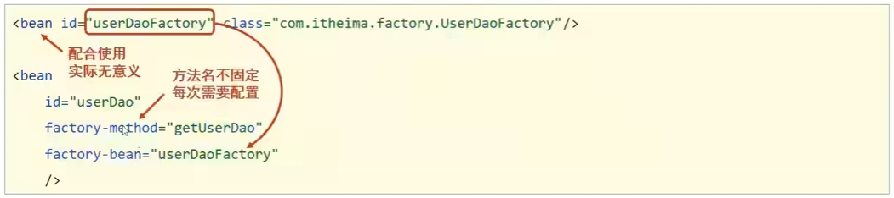
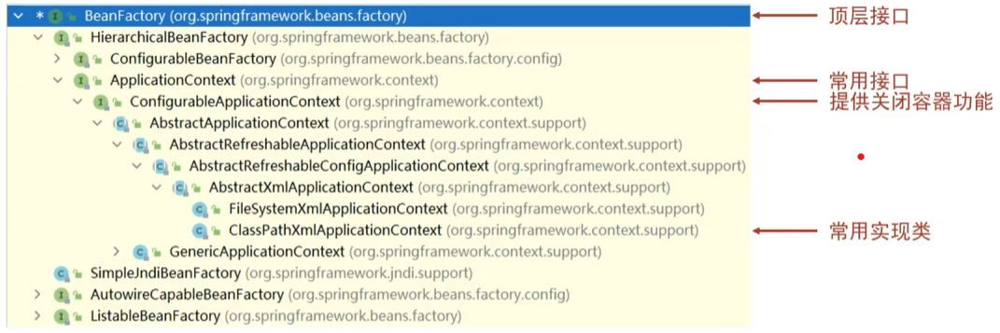
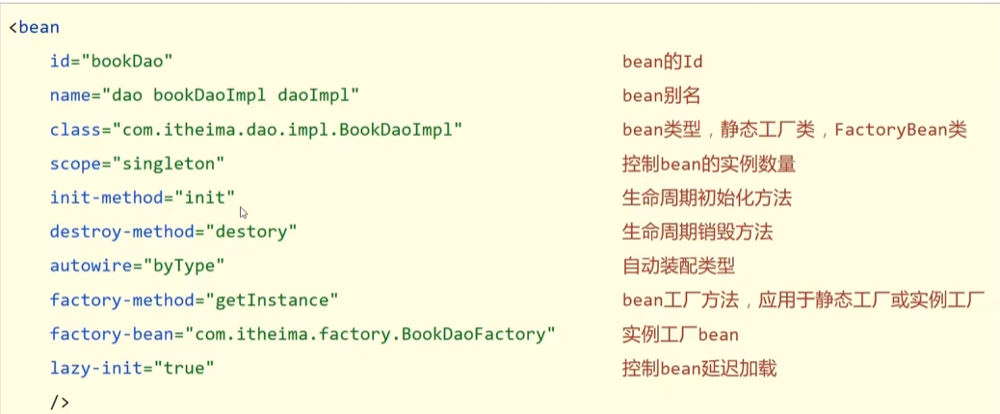
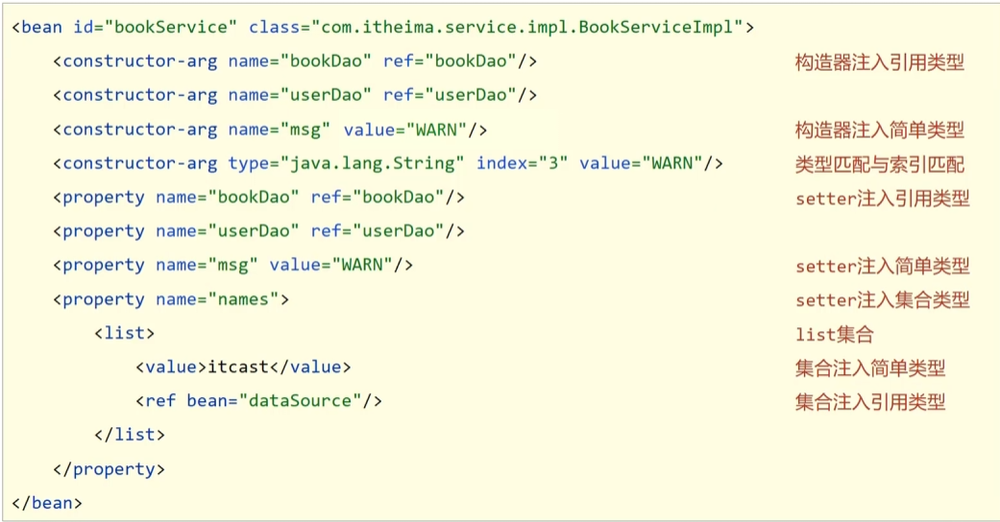
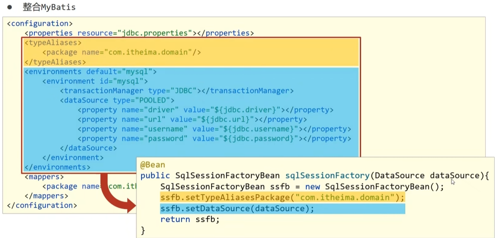
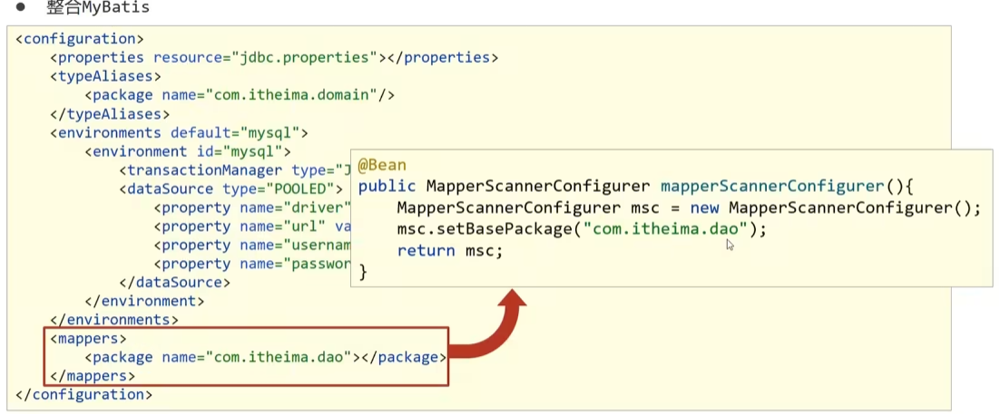
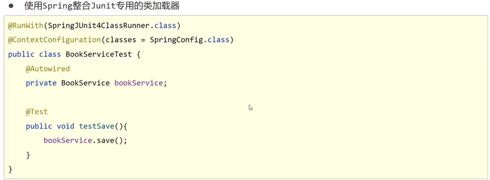
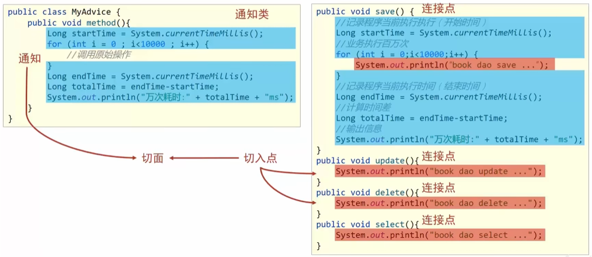
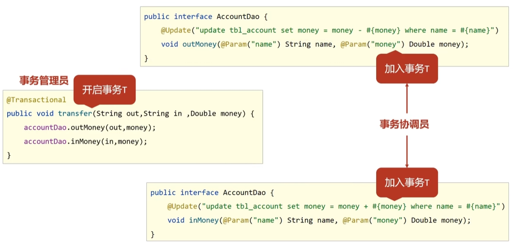
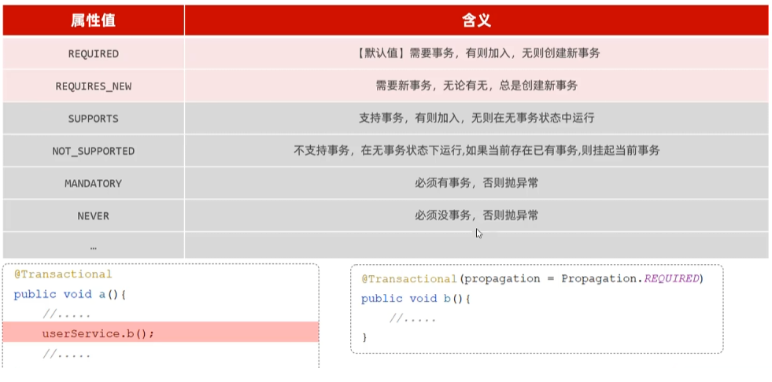

# Spring 简介

Spring 是一个开源的 Java 平台，为开发企业级应用程序提供了全面的基础架构支持。Spring 框架的核心功能包括依赖注入（DI）、面向切面编程（AOP）、事务管理、MVC
框架等。Spring 生态系统还包括许多其他模块，如 Spring Boot、Spring Data、Spring Security 等，这些模块进一步简化了企业级应用的开发。

## 主要特性

- **依赖注入（DI）**：通过依赖注入，Spring 可以自动管理对象的生命周期和依赖关系，减少代码耦合。
- **面向切面编程（AOP）**：Spring 提供了强大的 AOP 支持，可以在不修改业务逻辑代码的情况下，添加横切关注点（如日志、事务管理等）。
- **事务管理**：Spring 提供了声明式事务管理，简化了事务处理的复杂性。
- **MVC 框架**：Spring MVC 是一个轻量级的 Web 框架，支持 RESTful 风格的 Web 服务开发。
- **集成支持**：Spring 提供了与其他技术和框架的集成支持，如 JPA、Hibernate、MyBatis 等。

## Spring常用注解

* **组件扫描和自动装配**
    * @Component：通用组件注解，用于标记任何 Spring 管理的 bean。
    * @Service：用于标记业务层组件。
    * @Repository：用于标记数据访问层组件。
    * @Autowired：用于自动装配依赖，可以用于字段、构造器、方法等。
    * @Qualifier：与 @Autowired 一起使用，指定具体的 bean 名称。
    * @Resource：类似于 @Autowired，但基于名称进行注入。
* **配置类和 Bean 定义**
    * @Configuration：标记一个类为配置类，替代 XML 配置文件。
    * @Bean：在配置类中定义一个 bean。
    * @Import：导入其他配置类。
    * @PropertySource：加载属性文件。
    * @Value：注入属性值，可以从属性文件或环境变量中获取。
* **事务管理**
    * @Transactional：声明事务管理，可以应用于类或方法。
* **AOP（面向切面编程）**
    * @Aspect：标记一个类为切面。
    * @Before：在方法调用前执行。
    * @After：在方法调用后执行。
    * @Around：在方法调用前后执行。
    * @AfterReturning：在方法成功返回后执行。
    * @AfterThrowing：在方法抛出异常后执行。
* **定时任务**
    * @Scheduled：定义定时任务。
    * @EnableScheduling：启用定时任务支持。
* **安全**
    * @Secured：基于角色的安全控制。
    * @PreAuthorize：基于表达式的安全控制。
    * @PostAuthorize：基于表达式的安全控制，方法执行后检查。
* **数据校验**
    * @Valid：用于验证方法参数或返回值。
    * @Validated：用于方法级别的验证。
    * @NotNull：验证字段不能为空。
    * @NotEmpty：验证字段不为空且长度不为零。
    * @Size：验证字段长度范围。
    * @Min 和 @Max：验证数值范围。
* **其他**
    * @Profile：根据环境激活不同的配置。
    * @Lazy：延迟初始化 bean。
    * @Scope：定义 bean 的作用域，如单例（singleton）、原型（prototype）等。
    * @Conditional：根据条件决定是否创建 bean。
    * @ConditionalOnClass：当类路径中存在指定类时创建 bean。
    * @ConditionalOnMissingClass：当类路径中不存在指定类时创建 bean。
    * @ConditionalOnProperty：根据属性值决定是否创建 bean。

## bean

### bean基础配置

* **名称：** bean
* **类型：** 标签
* **所属：** beans标签
* **功能：** 定义Spring核心容器管理的对象
* **格式：**

```xml

<beans>
    <bean></bean>
</beans>
```

* **属性列表：** id:bean的id，使用容器可以通过id值获取对应的bean，在一个容器中id值唯一;class:bean的类型，即配置的bean的全路径类名
* **范例：**

````xml

<bean id="bookDao" class="com.itheima.dao.impl.BookDaoImpl"/>
<bean id="bookService" class="com.itheima.service.impl.BookServiceImpl"></bean>
````

### bean别名配置

* **名称：** name
* **类型：** 属性
* **所属：** bean标签
* **功能：** 定义bean的别名，可定义多个，使用逗号(，)分号(;)空格()分隔
* **范例：**

```xml

<bean id="bookDao" name="dao bookDaoImpl" class="com.itheima.dao,impl.BookDaoImpl"/>
<bean name="service,bookServiceImpl" class="com,itheima.service.impl.BookServiceImp1"/>
```

**注意事项：** 获取bean无论是通过id还是name获取，如果无法获取到，将抛出异常NoSuchBeanDefinitionException
NoSuchBeanDefinitionException: No bean named 'bookServiceImpl' available

### bean作用范围配置

* **名称：** scope
* **类型：** 属性
* **所属：** bean标签
* **功能：** 定义bean的作用范围，可选范围如下:1.singleton:单例(默认);2.prototype:非单例
* **范例：** ```<bean id="bookDao" class="com.itheima.dao.impl.BookDaoImpl" scope="prototype" />```

### bean实例化-构造方法

##### 实例化bean的三种方式----构造方法（常用）

* 提供可访问的构造方法

```java
public class BookDaoImpl implements BookDao {
    public BookDaoImp1() {
        System.out.println("book constructor is running");
    }

    public void save() {
        System.out.println("book dao save ...");
    }
}
```

* 无参构造方法如果不存在，将抛出异常BeancreationException

### bean实例化-静态工厂

##### 实例化bean的三种方式----静态工厂（了解）

* 静态工厂

```java
public class orderDaoFactory {
    public static orderDao getorderDao() {
        return new OrderDaoImpl();
    }
}
```

* 配置

```xml

<bean
        id="orderDao"
        factory-method="getOrderDao"
        class="com.itheima.factory.0rderDaoFactory"/>
```

### bean实例化-实例工厂

##### 实例化bean的三种方式----实例工厂（了解）

* 实例工厂

```java
public class UserDaoFactory {
    public UserDao getUserDao() {
        return new UserDaoImpl();
    }
}
```

* 配置
  

### bean的生命周期

* 提供生命周期控制方法

```java
public class BookDaoImpl implements BookDao {
    public void save() {
        System.out.println("book dao save ...");

    }

    public void init() {
        System.out.println("book init ...");

    }

    public void destory() {
        System.out.println("book destory ...");
    }
}
```

* 配置生命周期控制方法
  `<bean id="bookDao" class="com,itheima.dao.impl.BookDaoImpl" init-method="init" destroy-method="destory"/>`

## 依赖注入方式

### setter注入

#### setter注入---引用类型

* 在bean中定义引用类型属性并提供可访问的set方法

```java
public class BookserviceImpl implements BookService {
    private BookDao bookDao;

    public void setBookDao(BookDao bookDao) {
        this.bookDao = bookDao;
    }
}
```

* 配置中使用property标签ref属性注入引用类型对象

```xml

<bean id="bookService" class="com.itheima.service.impl.BookServiceImpl">
    <property name="bookDao" ref="bookDao"/>
</bean>
<bean id="bookDao" class="com.itheima.dao.impl.BookDaoImpl"/>
```

#### setter注入---简单类型

* 在bean中定义引用类型属性并提供可访问的set方法

```java
public class BookDaoImpl implements BookDaoprivate {

    int connectionNumber;

    public void setconnectionNumber(int connectionNumber) {
        this.connectionNumber = connectionNumber;
    }
}

```

* 配置中使用property标签value属性注入简单类型数据

```xml

<bean id="bookDao" class="com.itheima.dao.impl.BookDaoImpl">
    <property name="connectionNumber" value="10"/>
</bean>
```

### 构造器注入

#### 构造器注入---引用类型（了解）

* 在bean中定义引用类型属性并提供可访问的构造方法

```java
public class BookserviceImpl implements BookService {
    private BookDao bookDao;

    public BookServiceImpl(BookDao bookDao) {
        this.bookDao = bookDao;
    }
}
```

* 配置中使用constructor-arg标签ref属性注入引用类型对象

```xml

<bean id="bookService" class="com.itheima.service.impl.BookServiceImpl">
    <constructor-arg name="bookDao" ref="bookDao"/>
</bean>
<bean id="bookDao" class="com.itheima.dao.impl.BookDaoImpl"/>
```

#### 构造器注入---简单类型（了解）

* 在bean中定义引用类型属性并提供可访问的set方法

```java
public class BookDaoImpl implements BookDao {
    private int connectionNumber;

    public void setConnectionNumber(int connectionNumber) {
        this.connectionNumber = connectionNumber;
    }
}
```

* 配置中使用constructor-arg标签value属性注入简单类型数据

```xml

<bean id="bookDao" class="com.itheima.dao.impl.BookDaoImpl">
    <constructor-arg name="connectionNumber" value="10"/>
</bean>
```

### 依赖注入方式选择

1. 强制依赖使用构造器进行，使用setter注入有概率不进行注入导致nu11对象出现
2. 可选依赖使用setter注入进行，灵活性强
3. Spring框架倡导使用构造器,第三方框架内部大多数采用构造器注入的形式进行数据初始化，相对严谨
4. 如果有必要可以两者同时使用，使用构造器注入完成强制依赖的注入，使用setter注入完成可选依赖的注入
5. 实际开发过程中还要根据实际情况分析，如果受控对象没有提供setter方法就必须使用构造器注入
6. 自己开发的模块推荐使用setter注入

### 依赖自动装配

* 配置中使用bean标签autowire属性设置自动装配的类型

```xml

<bean id="bookDao" class="com.itheima.dao.impl.BookDaoImpl"/>
<bean id="bookService" class="com.itheima.service.impl.BookServiceImpl" autowire="byType"/>
```

**依赖自动装配特征**

* 自动装配用于引用类型依赖注入，不能对简单类型进行操作
* 使用按类型装配时(byType)必须保障容器中相同类型的bean唯一，推荐使用
* 使用按名称装配时(byName)必须保障容器中具有指定名称的bean，因变量名与配置耦合，不推荐使用
* 自动装配优先级低于setter注入与构造器注入，同时出现时自动装配配置失效

## 容器

### 创建容器

* 方式一：类路径加载配置文件

```java
ApplicationContext ctx = new ClassPathXmlApplicationContext("applicationcontext.xml");
```

* 方式二:文件路径加载配置文件

```java
Applicationcontext ctx = new filesystemXmlApplicationContext("D:\\applicationContext.xml");
```

* 加载多个配置文件

```java
ApplicationContext ctx = new classPathXmlApplicationContext("bean1.xml", "bean2.xml");
```

### 获取bean

* 方式一:使用bean名称获取

```java
BookDao bookDao = (BookDao) ctx.getBean("bookDao");
```

* 方式二:使用bean名称获取并指定类型

```java
BookDao bookDao = ctx.getBean("bookDao", BookDao.class);
```

* 方式三:使用bean类型获取

```java
BookDao bookDao = ctx.getBean(BookDao.class);
```

### 容器层次结构

**容器类层次结构图**



### BeanFactory

**BeanFactory初始化**

* 类路径加载配置文件

```java
Resource resources = new classPathResource("applicationContext.xml");
BeanFactory bf = newXmlBeanFactory(resources);
BookDao bookDao = bf.getBean("bookDao", BookDao.class);
bookDao.

save();
```

* BeanFactory创建完毕后，所有的bean均为延迟加载

## 核心容器总结

### 容器相关

* BeanFactory是IoC容器的顶层接口，初始化BeanFactory对象时，加载的bean延迟加载
* Applicationcontext接口是Spring容器的核心接口，初始化时bean立即加载
* Applicationcontext接口提供基础的bean操作相关方法，通过其他接口扩展其功能
* Applicationcontext接口常用初始化类
    * ClassPathXmlApplicationContext
    * FileSystemXmlApplicationContext

### bean相关



### 依赖注入相关



## 注解开发

## Spring整合MyBatis




## Spring整合Junit



## AOP

### AOP简介



#### AOP核心概念

* 连接点(JoinPoint):程序执行过程中的任意位置，粒度为执行方法、抛出异常、设置变量等
    * 在SpringA0P中，理解为方法的执行
* 切入点(Pointcut):匹配连接点的式子
    * 在SpringAoP中，一个切入点可以只描述一个具体方法，也可以匹配多个方法
        * 一个具体方法:com.itheima.dao包下的BookDao接口中的无形参无返回值的save方法
        * 匹配多个方法:所有的save方法，所有的get开头的方法，所有以Dao结尾的接口中的任意方法，所有带有一个参数的方法
* 通知(Advice):在切入点处执行的操作，也就是共性功能
    * 在SpringA0P中，功能最终以方法的形式呈现
* 通知类:定义通知的类
* 切面(Aspect):描述通知与切入点的对应关系

### AOP入门案例

1. 导入aop相关坐标

```xml

<dependency>
    <groupId>org.aspectj</groupId>
    <artifactId>aspectjweaver</artifactId>
    <version>1.9.4</yersion>
</dependency>
        <!--说明：spring-context坐标依赖spring-aop坐标-->
```

2. 定义dao接口与实现类

```java
public interface BookDao {
    public void save();

    public void update();
}
```

```java

@Repository
public class BookDaoImpl implements BookDao {
    public void save() {
        System.out.println(System.currentTimeMillis());
        System.out.println("book dao save ...");
    }

    public void update() {
        System.out.println("book dao update ...");
    }
}
```

3. 定义通知类，制作通知

```java
public class MyAdvice {
    public void before() {
        System.out.prinln(System.currentTimeMillis());
    }
}
```

4. 定义切入点

```java
public class MyAdvice {
    @Pointcut("execution(void com.itheima.dao.BookDao.update())")
    private void pt() {
    }
    //说明:切入点定义依托一个不具有实际意义的方法进行，即无参数，无返回值，方法体无实际逻辑
}
```

5. 定义通知类受Spring容器管理，并定义当前类为切面类

```java

@Component
@Aspect
public class MyAdvice {
    @Pointcut("execution(void com.itheima.dao.BookDao.update())")
    private ygid pt() {
    }

    @Before("pt()")
    public void before() {
        System.out.println(System.currentTimeMillis());
    }
}

```

7. 开启Spring对AOP注解驱动支持

```java

@Configuration
@Componentscan("com.itheima")
@EnableAspectJAutoProxypublic
class springconfig {

}
```

### AOP切入点表达式

#### 语法格式

* 切入点表达式标准格式:动作关键字(访问修饰符 返回值 包名.类/接口名.方法名(参数)异常名)

```java
execution(public User com.itheima.service.UserService.findById(int))
```

* 动作关键字:描述切入点的行为动作，例如execution表示执行到指定切入点
* 访问修饰符:public，private等，可以省略
* 返回值
* 包名
* 类/接口名
* 方法名
* 参数
* 异常名:方法定义中抛出指定异常，可以省略

#### 通配符

* 可以使用通配符描述切入点，快速描述
    * '*'：单个独立的任意符号，可以独立出现，也可以作为前缀或者后缀的匹配符出现
      `execution(public * com.itheima.*.UserService.find*(*))`
        * 匹配com.itheima包下的任意包中的UserService类或接口中所有find开头的带有一个参数的方法
    * '..' : 多个连续的任意符号，可以独立出现，常用于简化包名与参数的书写
      `execution(public User com..UserService.findById(..))`
        * 匹配com包下的任意包中的UserService类或接口中所有名称为findByld的方法
    * '+' :专用于匹配子类类型
      `execution(* *..*Service+.*(..))`

#### 书写技巧

* 所有代码按照标准规范开发，否则以下技巧全部失效
* 描述切入点通常描述接口，而不描述实现类
* 访问控制修饰符针对接口开发均采用public描述(可省略访问控制修饰符描述）
* 返回值类型对于增删改类使用精准类型加速匹配，对于查询类使用*通配快速描述
* 包名书写尽量不使用..匹配，效率过低，常用”做单个包描述匹配，或精准匹配
* 接口名/类名书写名称与模块相关的采用*匹配，例如UserService书写成*Service,绑定业务层接口名
* 方法名书写以动词进行精准匹配，名词采用*匹配，例如getByld书写成getBy*,selectAl书写成selectAl
* 参数规则较为复杂，根据业务方法灵活调整
* 通常不使用异常作为匹配规则

### AOP通知类型

* AOP通知描述了抽取的共性功能，根据共性功能抽取的位置不同，最终运行代码时要将其加入到合理的位置
* AOP通知共分为5种类型:
    * 前置通知
    * 后置通知
    * 环绕通知(重点)
    * 返回后通知(了解)
    * 抛出异常后通知(了解)

#### 前置通知：

* 名称:@Before
* 类型方法注解
* 通知方法定义上方位罟
* 作用:设置当前通知方法与切入点之间的绑定关系，当前通知方法在原始切入点方法前运行
* 范例:

```java

@Before("pt()")
public void before() {
    System.out.println("before advice ...");
}
```

* 相关属性:value(默认):切入点方法名，格式为类名.方法名()

#### 后置通知：

* 名称:@ After
* 类型:方法注解
* 位置:通知方法定义点方
* 作用:设置当前通知方法与切入点之间的绑定关系，当前通知方法在原始切入点方法后运行
* 范例:

```java

@After("pt()")
public void after() {
    System.out.println("after advice ...");
}
```

* 相关属性:value(默认):切入点方法名，格式为类名.方法名()

#### 环绕通知：

* 名称:@Around(重点，常用)
* 类型:方法注解
* 位置:通知方法定义上方
* 作用:设置当前通知方法与切入点之间的绑定关系，当前通知方法在原始切入点方法前后运行
* 范例:

```java

@Around("pt()")
public object around(ProceedingJoinPoint pip) throws Throwable {
    System.out.println("around before advice ...");
    object ret = pjp.proceed();
    System.out.println("around after advice ...");
    return ret;
}
```

#### 注意事项：

* @Around注意事项
    1. 环绕通知必须依赖形参ProceedingjoinPoint才能实现对原始方法的调用，进而实现原始方法调用前后同时添加通知
    2. 通知中如果未使用ProceedingjoinPoint对原始方法进行调用将跳过原始方法的执行
    3. 对原始方法的调用可以不接收返回值，通知方法设置成void即可，如果接收返回值，必须设定为Object类型
    4. 原始方法的返回值如果是void类型，通知方法的返回值类型可以设置成void，也可以设置成Object
    5. 由于无法预知原始方法运行后是否会抛出异常，因此环绕通知方法必须抛出Throwable对象

```java

@Around("pt()")
public Object around(ProceedingJoinPoint pip) throws Throwable {
    System.out.println("around before advice ...");
    Object ret = pjp.proceed();
    System.out.println("around after advice ...");
    return ret;
}
```

### AOP获取通知数据

#### AOP通知获取参数数据

* JoinPoint对象描述了连接点方法的运行状态，可以获取到原始方法的调用参数

```java

@Before("pt()")
public void before(JoinPoint jp) {
    Object[] args = jp.getArgs();
    System.out.println(Arnays.toString(args));
}
```

* ProceedJointPoint是JoinPoint的子类

```java

@Around("pt()")
public object around(ProceedingJoinPoint pjp) throws Throwable {
    Object[] args = pjp.getArgs();
    System.out.println(Arrays.tostring(args));
    Object ret = pjp.proceed();
    return ret;
}
```

#### AOP通知获取返回值数据

* 抛出异常后通知可以获取切入点方法中出现的异常信息，使用形参可以接收对应的异常对象

```java

@AfterReturning(value = "pt()", returning = "ret")
public void afterReturning(string ret) {
    System.out.println("afterReturning advice ..." + ret);
}
```

* 环绕通知中可以手工书写对原始方法的调用，得到的结果即为原始方法的返回值

```java

@Around("pt()")
public Object around(ProceedingJoinPoint pjp) throws Throwable {
    Object ret = pjp.proceed();
    return ret;
}
```

### AOP总结

#### 概念

* 概念:A0P(Aspect 0riented Programming)面向切面编程，一种编程范式
* 作用:在不惊动原始设计的基础上为方法进行功能增强
* 核心概念
    * 代理(Proxy):SpringA0P的核心本质是采用代理模式实现的
    * 连接点(JoinPoint):在SpringA0P中，理解为任意方法的执行
    * 切入点(Pointcut):匹配连接点的式子，也是具有共性功能的方法描述
    * 通知(Advice):若干个方法的共性功能，在切入点处执行，最终体现为一个方法
    * 切面(Aspect):描述通知与切入点的对应关系
    * 目标对象(Target):被代理的原始对象成为目标对象

#### 通知类型

* 前置通知
* 后置通知
* 环绕通知(重点)
    * 环绕通知依赖形参ProceedingJoinPoint才能实现对原始方法的调用环绕通知可以隔离原始方法的调用执行
    * 环绕通知返回值设置为0bject类型
    * 环绕通知中可以对原始方法调用过程中出现的异常进行处理
* 返回后通知
* 抛出异常后通知

#### 切入点

* 获取切入点方法的参数
    * JoinPoint:适用于前置、后置、返回后、抛出异常后通知，设置为方法的第一个形参
    * ProceedJointPoint:适用于环绕通知
* 获取切入点方法返回值
    * 返回后通知
    * 环绕通知
* 获取切入点方法运行异常信息
    * 抛出异常后通知
    * 环绕通知

#### 使用aop时有两种切入方式

* 注解切入点
    * 灵活性高：可以通过自定义注解来标记需要进行切面处理的方法，适用于需要在多个地方应用相同切面逻辑的场景。
    * 可维护性强：注解可以集中管理，修改注解的逻辑时，所有使用该注解的地方都会受到影响，减少了重复代码。
    * 代码清晰：使用注解可以使得业务代码更加清晰，关注点分离更明确。

```java
public class MyAspect {
    @Pointcut("@annotation(com.example.MyCustomAnnotation)")
    public void myPointcut() {
    }

    @Before("myPointcut()")
    public void beforeAdvice(JoinPoint joinPoint) {
        // 切面逻辑
    }
}
```

* 指定方法名
    * 精确控制：可以直接指定需要进行切面处理的具体方法，适用于需要对特定方法进行精确控制的场景。
    * 简单直观：对于简单的应用场景，直接指定方法名更加直观易懂，不需要额外定义注解。

```java

@Aspect
@Component
public class MyAspect {

    @Pointcut("execution(* com.example.service.MyService.myMethod(..))")
    public void myPointcut() {
    }

    @Before("myPointcut()")
    public void beforeAdvice(JoinPoint joinPoint) {
        // 切面逻辑
    }
}
```

* **总结：**

1. 注解切入点更适合于需要在多个地方应用相同切面逻辑的场景，具有更高的灵活性和可维护性。
2. 指定方法名更适合于需要对特定方法进行精确控制的简单场景，更加直观和容易理解。

#### aop实现公共字段自动注入案例（黑马苍穹外卖知识点）

* **步骤一：** 自定义注解

```java
package com.zjjhy.common.annotation;

import com.zjjhy.common.enums.OperationType;

import java.lang.annotation.ElementType;
import java.lang.annotation.Retention;
import java.lang.annotation.RetentionPolicy;
import java.lang.annotation.Target;

/**
 * 自定义注解,用于标识某个方法需要进行功能字段自动填充处理
 */
@Target(ElementType.METHOD)
@Retention(RetentionPolicy.RUNTIME)
public @interface AutoFill {
    //数据库操作类型,UPDATE,INSERT
    OperationType value();
}
```

* **步骤二：** 定义常量方法名

```java
package com.zjjhy.common;

public interface Constants {
    String SET_CREATE_TIME = "setCreateTime" ;
    String SET_UPDATE_TIME = "setUpdateTime" ;
}
```

* **步骤三：** 定义aop切面类

```java
package com.zjjhy.common.aspect;

import com.zjjhy.common.Constants;
import com.zjjhy.common.annotation.AutoFill;
import com.zjjhy.common.enums.OperationType;
import jakarta.servlet.http.HttpServletRequest;
import lombok.extern.slf4j.Slf4j;
import org.aspectj.lang.JoinPoint;
import org.aspectj.lang.annotation.Aspect;
import org.aspectj.lang.annotation.Before;
import org.aspectj.lang.annotation.Pointcut;
import org.aspectj.lang.reflect.MethodSignature;
import org.springframework.stereotype.Component;
import org.springframework.web.context.request.RequestContextHolder;
import org.springframework.web.context.request.ServletRequestAttributes;

import java.lang.reflect.Method;
import java.time.LocalDateTime;

/**
 * 自定义切面,实现公共字段自动填充处理逻辑
 */
@Aspect
@Component
@Slf4j
public class AutoFillAspect {

    /**
     * 注解切入点
     */
    @Pointcut("@annotation(com.zjjhy.common.annotation.AutoFill)")
    public void autoFillPointCut() {
    }

    /**
     * 前置通知,在通知中进行公共字段的赋值
     */
    @Before("autoFillPointCut()")
    public void autoFill(JoinPoint joinPoint) {
        log.info("开始进行公共字段的填充...");

        /**
         * @Autowired 注入 HttpServletRequest：在大多数情况下可以工作，但在多线程环境或某些特定的 AOP 切面中可能无法获取到当前请求的上下文。
         * 使用 RequestContextHolder：这是一种更安全的方法，确保在任何情况下都能获取到当前请求的 HttpServletRequest。
         */
        ServletRequestAttributes attributes = (ServletRequestAttributes) RequestContextHolder.getRequestAttributes();
        HttpServletRequest request = attributes != null ? attributes.getRequest() : null;

        //获取到当前被拦截的方法上的数据库操作类型
        MethodSignature signature = (MethodSignature) joinPoint.getSignature();//方法签名对象
        AutoFill autoFill = signature.getMethod().getAnnotation(AutoFill.class);//获得方法上的注解对象
        OperationType operationType = autoFill.value();//获得数据库操作类型

        //获取到当前被拦截的方法的参数 -- 实体对象
        Object[] args = joinPoint.getArgs();
        if (args == null || args.length == 0) {
            return;
        }

        //实体对象数组
        Object pojo = args[0];
        log.info("args:{}", args);

        //准备赋值的数据
        LocalDateTime now = LocalDateTime.now();

        //根据当前不同的操作类型,为对应的属性赋值通过反射赋值
        if (operationType == OperationType.INSERT) {
            try {
                //为两个公共字段赋值
                Method setCreateTime = pojo.getClass().getDeclaredMethod(Constants.SET_CREATE_TIME, LocalDateTime.class);
                Method setUpdateTime = pojo.getClass().getDeclaredMethod(Constants.SET_UPDATE_TIME, LocalDateTime.class);

                //通过反射为对象属性赋值
                setCreateTime.invoke(pojo, now);
                setUpdateTime.invoke(pojo, now);
            } catch (Exception e) {
                throw new RuntimeException(e);
            }
        } else if (operationType == OperationType.UPDATE) {
            try {
                //为一个公共字段赋值
                Method setUpdateTime = pojo.getClass().getDeclaredMethod("setUpdateTime", LocalDateTime.class);

                //通过反射为对象属性赋值
                setUpdateTime.invoke(pojo, now);
            } catch (Exception e) {
                throw new RuntimeException(e);
            }
        }
    }
}
```

## Spring事务

### Spring事务简介

#### 案例(银行账户转账)

1. 在业务层接口上添加Spring事务管理

```java
public interface Accountservice {
    @Transactional
    public void transfer(string out, string in, Double money);
}
```

* **注意事项:** Spring注解式事务通常添加在业务层接口中而不会添加到业务层实现类中，降低耦合注解式事务可以添加到业务方法上表示当前方法开启事务，也可以添加到接口上表示当前接口所有方法开启事务

2. 设置事务管理器

```java

@Bean
public PlatformTransactionManager transactionManager(DataSource dataSource) {
    DataSourceTransactionManager ptm = new DataSourceTransactionManager();
    ptm.setDataSource(dataSource);
    return ptm;
}
```

* **注意事项:** 事务管理器要根据实现技术进行选择MyBatis框架使用的是JDBC事务

3. 开启注解式事务驱动

```java

@Configuration
@ComponentScan("com.itheima")
@PropertySource("classpath:jdbc.properties")
@Import({JdbcConfig.class, MybatisConfig.class})
@EnableTransactionManagementpublic
class springConfig {

}
```

### Spring事务角色



* 事务角色
    * 事务管理员:发起事务方，在Spring中通常指代业务层开启事务的方法
    * 事务协调员:加入事务方，在Spring中通常指代数据层方法，也可以是业务层方法

### Spring事务属性

1. rollbackFor(事务属性-回滚)
    * 默认情况下，只有出现 RuntimeException 才回滚异常。rollbackFor属性用于控制出现何种异常类型，回滚事务。

```java

@Transactional(rollbackFor = Exception.class)
@Override
public void delete(Integer id) throws ExceptiondeptMapper {
    deptMapper.deleteById(id); //删除部门
    if (true) {
        throw new Exception("出错啦啦...");
    }
    empMapper.deleteByDeptId(id);//删除部门下的员工
}
```

2. propagation(事务属性-传播行为)



* **场景**
    * REQUIRED:大部分情况下都是用该传播行为即可。
    * REQUIRES NEW:当我们不希望事务之间相互影响时，可以使用该传播行为。比如:下订单前需要记录日志，不论订单保存成功与
      否，都需要保证日志记录能够记录成功。

## 总结

- **Spring 是一个功能强大且灵活的 Java 框架，通过依赖注入、面向切面编程、事务管理等核心功能，简化了企业级应用的开发。Spring**
