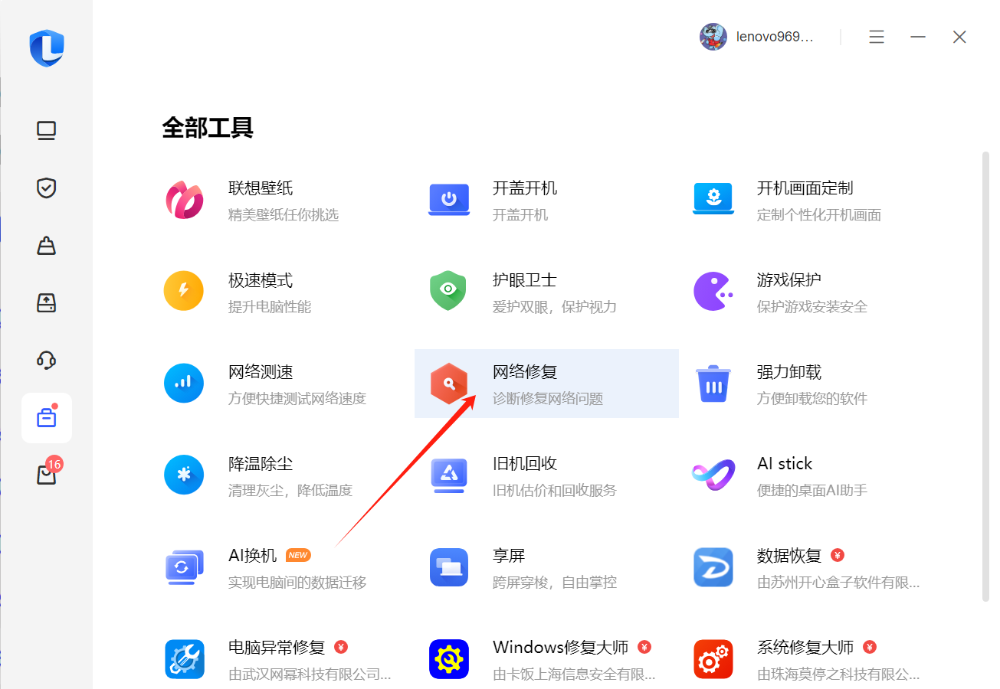

# 踩坑

## 一.用idea自带的用.分割单词名会创建分层目录结构，但是当用SpringConfig和mybatis扫描mapper层的引用地址时就会出问题。

### 错误示例：但是使用idea自带的.分割目录时会创建以下结构

```html
├── com.example
│   ├── mapper
```

### 正常示例：

```html
├── com
│   ├── example
│   └──────mapper
```

## 二.在vue中，给自定义组件添加事件监听是不会触发的，vue默认是在监听组件内部触发的自定义事件,而不是原生DOM事件。

### 错误示例：

```vue
<!--给element的下拉框组件添加事件监听-->
<el-dropdown-item @click="quit">退出登录</el-dropdown-item>
```

### 正确示例：

```vue
<!--加上native修饰之后vue会在组件的根元素上监听原生事件-->
<el-dropdown-item @click.native="quit">退出登录</el-dropdown-item>
```

### **总结:** 使用.native修饰符可以使代码更加直观，明确地表明这是一个监听原生DOM事件的处理函数。这样不仅提高了代码的可读性，还方便了后续的维护和理解。

## 三.vue-router3.0版本重复重定向导航会报错

### 错误示例：

```vue
<!--重复重定向导航会报错-->
<el-dropdown-item @click.native="$router.push('/managerPwd')">修改密码</el-dropdown-item>
```

### 正确示例：配置vue-router

```javascript
//处理面包屑导航中的vue-router在3.0版本频繁重定向导航报错问题
const originalPush = VueRouter.prototype.push
VueRouter.prototype.push = function push(location) {
    return originalPush.call(this, location).catch(err => err)
}
```

## 四.在mybatis的mapper映射层传递一个对象，两个整数类型，在xml映射文件会报找不到实体类中某个属性的异常

```java
//mapper接口
List<DocsVo> queryByDocsData(Docs docs, Integer page, Integer pageSize);
```

### 错误示例

```xml
<!--会抛出Parameter 'id' not found异常-->
<select id="queryByDocsData" parameterType="object" resultType="com.zjjhy.pojo.vo.DocsVo">
    select a.username, d.id, d.docs_title, d.docs_content, d.create_time
    from blog_docs d
    join blog_account a
    <trim prefix="where " suffixOverrides="and">
        d.account_id = a.id
        <if test="id != null">and id=#{id}</if>
        <if test="accountId != null">and account_id=#{accountId}</if>
        <if test="docsTitle != null">and docs_title like concat('%',#{docsTitle},'%')</if>
        <if test="docsContent != null">and docs_content like concat('%',#{docsContent}'%')</if>
        <if test="createTime != null">and create_time=#{createTime}</if>
        <if test="updateTime != null">and update_time=#{updateTime}</if>
    </trim>
    limit #{page},#{pageSize}
</select>
```

### 正确示例

```xml
<!--给if语句加上对象的引用地址.属性名-->
<select id="queryByDocsData" parameterType="object" resultType="com.zjjhy.pojo.vo.DocsVo">
    select a.username, d.id, d.docs_title, d.docs_content, d.create_time
    from blog_docs d
    join blog_account a
    <trim prefix="where " suffixOverrides="and">
        d.account_id = a.id
        <if test="docs.id != null">and id=#{docs.id}</if>
        <if test="docs.accountId != null">and account_id=#{docs.accountId}</if>
        <if test="docs.docsTitle != null">and docs_title like concat('%',#{docs.docsTitle},'%')</if>
        <if test="docs.docsContent != null">and docs_content like concat('%',#{docs.docsContent}'%')</if>
        <if test="docs.createTime != null">and create_time=#{docs.createTime}</if>
        <if test="docs.updateTime != null">and update_time=#{docs.updateTime}</if>
    </trim>
    limit #{page},#{pageSize}
</select>
```

## 五.在SpringBoot控制层使用@RequestBody注解接受请求体时，如果前端传递的是一个空请求体，SpringMVC会将形参引用new为一个默认的空对象实例，而不是 null。因此，形参 会有一个有效的 hashCode 值。

### 错误示例

```java
// 1.前端传递空请求体，但是SpringMVC会将形参引用new为一个默认的空对象的实例，而不是null
// 2.来到第一个if判断，前端传空请求体了，按理说if返回true，但是执行完成---->if返回false
// 3.因为形参被SpringMVC实例化了，不能直接判断引用
@PostMapping("/validateDocs")
public Result validateDocs(@RequestBody DocsDto docsDto) {
    // 空对象返回参数缺失
    if (ObjectUtil.isEmpty(docsDto)) {
        return Result.error(ResultCodeEnum.PARAM_LOST_ERROR);
    }
    List<DocsVo> list = adminSystemHomeService.validateDocs(docsDto);
    //不存在返回200通过规则效验
    if (ObjectUtil.isEmpty(list)) {
        return Result.success(ResultCodeEnum.SUCCESS);
    }
    return Result.error(ResultCodeEnum.DOCS_EXIST_ERROR);
}
```

### 正确示例

```java
//我的办法只有单独拿出来对象中的属性判断或者去service层处理
@PostMapping("/validateDocs")
public Result validateDocs(@RequestBody DocsDto docsDto) {
    // 空对象返回参数缺失
    if (ObjectUtil.isEmpty(docsDto.getDocsTitle())) {
        return Result.error(ResultCodeEnum.PARAM_LOST_ERROR);
    }
    List<DocsVo> list = adminSystemHomeService.validateDocs(docsDto);
    //不存在返回200通过规则效验
    if (ObjectUtil.isEmpty(list)) {
        return Result.success(ResultCodeEnum.SUCCESS);
    }
    return Result.error(ResultCodeEnum.DOCS_EXIST_ERROR);
}
```

### 总结

* 成员变量（实例变量和静态变量）：默认值为 null。
* 局部变量：必须在使用前初始化，否则编译错误。
* 方法参数：由调用者提供，如果没有提供或者提供了 null，则参数的值为 null。
* 数组元素：默认值为 null。
* @RequestBody 注解的参数：如果请求体为空，Spring MVC 会将其new为一个默认的空对象的实例，而不是null
    * 通过这些，可以更好地理解和处理 Java 中对象引用的默认值。

## 六.在使用SpringBoot统一返回Result响应对象时，如果抛出TypeNotAcceptableException异常，通常是因为SpringMVC在将Java对象序列化为JSON格式时无法正确地读取对象的属性。这通常是由于缺少 getter 和 setter 方法导致的。

### 错误示例：没有提供成员属性的get和set方法或lombok的@Data注解

### 正确示例：提供成员属性的get和set方法或lombok的@Data注解

### **总结：**

1. 前端请求数据为JSON格式时，SpringMVC会调用实体类中的set方法将前端http请求中的JSON格式数据数据反序列化为java对象
2. 后端响应数据为java对象时，SpringMVC会调用实体类中的get方法将后端java对象序列化为JSON格式数据

3. 确保实体类中提供了所有必要的 getter 和 setter 方法，这样 Spring MVC 才能正确地进行数据的反序列化和序列化操作。使用
   Lombok 的 @Data 注解可以自动生成这些方法，简化代码编写。

## 七.使用 subList(0, 10) 方法时，如果原列表的长度小于 10，会抛出 IndexOutOfBoundsException 异常。这是因为 subList 方法要求结束索引必须在列表的有效范围内。

### 错误示例：

```java
import java.util.ArrayList;
import java.util.List;

public static void main(String[] args) {
    List data = new ArrayList();
    int beginPage = (page - 1) * pageSize;
    int endPage = beginPage + pageSize;
    pageVo.setData(data.subList(beginPage, endPage));
}
```

### 正确示例

```java
import java.util.ArrayList;
import java.util.List;

public static void main(String[] args) {
    List data = new ArrayList();
    int beginPage = (page - 1) * pageSize;
    int endPage = Math.min(beginPage + pageSize, range.size());
    pageVo.setData(data.subList(beginPage, endPage));
}
```

### 总结：

* Math.min 方法是 Java 标准库中的一个静态方法，用于返回两个参数中的较小值。它的原理非常简单，主要通过比较两个参数的大小来决定返回哪个值。
* 常用来用java方法实现分页

```java
// Math.min()源码
public static int min(int a, int b) {
    return (a <= b) ? a : b;
}
```

## 八.vue中引入图片不使用require()会报错

### require方法简介

* require()是node里面中的一个方法
* 他的作用是“用于引入模块、 JSON、或本地文件”。
* 也就是说如果我们使用 require 来引入一个图片文件的话，那么require 返回的就是用于引入的图片(npm 运行之后图片的编译路径)
  而如果使用字符串的话，那么则是一个 string 类型的固定字符串路径,不是编译路径会报错。

### 错误示例

```vue

<template>
  <div style="display:flex;">
    <div v-for="item in imgUrl" :key="item.id"></div>
  </div>
</template>
<script>
  export default {
    data() {
      return {
        //下面的正确的注意要用require
        imgUrl: [
          {id: 1, imgSrc: "../../images/1.jpg"},
          {id: 2, imgSrc: "../../images/2.jpg"},
          {id: 3, imgSrc: "../../images/3.jpg"},
        ]
      }
    },
    created() {
    },
    methods: {}
  }
</script>
```

### 正确示例

```vue

<template>
  <div style="display:flex;">
    <div v-for="item in imgUrl" :key="item.id"></div>
  </div>
</template>
<script>
  export default {
    data() {
      return {
        //下面的正确的注意要用require
        imgUrl: [
          {id: 1, imgSrc: require("../../images/1.jpg")},
          {id: 2, imgSrc: require("../../images/2.jpg")},
          {id: 3, imgSrc: require("../../images/3.jpg")},
        ]
      }
    },
    created() {
    },
    methods: {}
  }
</script>
```

### 总结：

* src 中引入的图片应该为图片的本身路径(相对路径或者绝对路径)，而 vue 项目通过 webpack 的 devServer 运行之后，默认的
  vue-cli 配置下，图片会被打包成 name.hash 的图片名，在这种情况下，如果我们使用固定的 字符串路径则无法找到该图片，所以需要使用
  require 方法来返回 图片的编译路径。

## 九.The user specified as a definer (‘root‘@‘%‘) does not exist --MySQL8.0.36报错 在写双碳的可视化平台，后端访问数据库时，居然访问视图的时候出错了(借鉴于CSDN 用户名：weixin_38625599)

### 分析：

* 当遇到`The user specified as a definer ('root'@'%') does not exist`
  错误时，这意味着MySQL系统无法找到DEFINER字段中指定的用户名和主机名的组合。例如，错误中的`'root'@'%'`表示名为`'root'`
  的用户在任何主机上都不存在。这可能是由于以下原因：

    * **用户未创建**：可能在数据库中根本就没有名为`'root'`的用户或者本地用户只有`'root@localhost'`
      ,当前表的视图定义者是`'root@%'`
    * **权限问题**：即使用户存在，但可能没有从任何主机访问数据库的权限。
    * **DEFINER与执行用户不匹配**：执行SQL语句的用户没有足够的权限去调用DEFINER为`'root'`的存储过程。

### 解决方案(mysql version 8.0.36)：

1. 创建新用户：`create user root@'%' identified by '123456'`
2. 授予所有权限：`grant all privileges on *.* to root@'%' with grant option`

* 结论：本地没有当前表的视图定义者所以在查询视图的时候 mysql会去检查视图定义者是否存在 不存在则会报这个错误

### mysql的`'root'@'localhost'`和`'root'@'%'`区别

* 'root'@'localhost'表示仅允许从本地主机访问数据库的root用户，而'root'@'%'则表示允许从任何主机访问数据库的root用户。
* 个人感觉`'root'@'%'`不安全任何地方的主机都可以访问，慎重使用

## 十.在本地用file协议打开html文件会出现引用外部文件错误。

### 例：```<link rel="stylesheet" href="/static/css/bootstrap.min.css" />```

### 分析：

* 具体表现为浏览器无法正确加载路径以 /static/ 开头的资源文件。这通常是因为 file
  协议下，相对路径解析与服务器环境不同，导致路径不匹配，实际上到浏览器解析的路径是：file:///D:
  /static/css/bootstrap.min.css,D盘下没有static文件

### 解决方案；

* 修改引用路径为：```<link rel="stylesheet" href="./static/css/bootstrap.min.css" />```

* 为什么要加点
    1. 明确相对路径：
        * 加点（.）表示当前目录。./static/ 表示从当前 HTML 文件所在的目录开始查找 static 文件夹。
        * 不加点时，浏览器可能会根据不同的协议（如 file 协议）或服务器配置解析路径，导致路径不匹配。
    2. 避免路径解析问题：
        * 在 file 协议下，相对路径解析与服务器环境不同。如果不加点，浏览器可能会错误地将路径解析为根目录或其他不正确的路径（例如
          D:），从而无法找到资源文件。
        * 加点可以确保路径始终相对于当前文件进行解析，避免路径解析的不确定性。
    3. 提高代码可移植性：
        * 使用相对路径（带点）可以使代码更易于移植到不同的环境（如开发、测试、生产环境），而不需要修改路径。

### 总结：

* 在开发时引用当前文件夹的资源时不要偷懒，做好加上一个点，避免使用环境冲突

## 十一.在使用jqery的load()方法时抛出CORS跨域异常

### 例：``` $('#content').load("./view/explain_info_view.html");```动态加载本地html文件并插入到content节点中

### 分析：使用web服务打开并不会异常，当在本地用file协议打开时就有异常，在使用 jQuery 的 load() 方法时，如果通过 file 协议异步请求本地 HTML 文件，会遇到 CORS（跨域资源共享）异常。这是因为浏览器的安全策略禁止从 file:// 协议加载外部资源，以防止潜在的安全风险

### 解决方案；

* 使用 `<iframe>` 标签,这种方法不需要 AJAX 请求，因此不会受到 CORS 限制。

* 例：

```html
 <!-- 1.动态加载外部资源到容器中 -->
<main id="content">
    <iframe
            id="content-frame"
            src="./view/explain_info_view.html"
            frameborder="0"
            width="100%"
            height="100%"
    ></iframe>
</main>
```

```javascript
// 2.使用 iframe 加载指定路径的内容到 id 为 "content-frame" 的元素中
$("#content-frame").attr("src", "./view/explain_info_view.html");
```

## 十二.本地配置hosts文件有问题导致访问不了个别网站

### 解决方案；

1. 清除cookies缓存
2. 使用电脑管家之类的通过网络诊断自动修复即可


